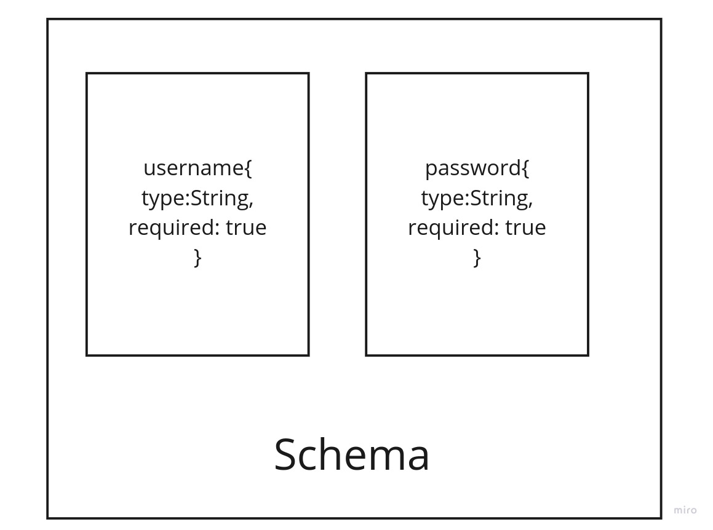

# authentication

## class 6

- Repository Name: `authentication`
- Branch Name: `class-11`

create api with basic authentication

### How to Use:

```
node nodes.js
```

## end points

- post: /signup

- post: /signin

-get: /users

### How to test:

```
Unit Tests: npm run test

Lint Tests: npm run lint
```

## How do I install the app or library?

```
 git clone https://github.com/Mohammad-Eshtaiwi/authentication
```


